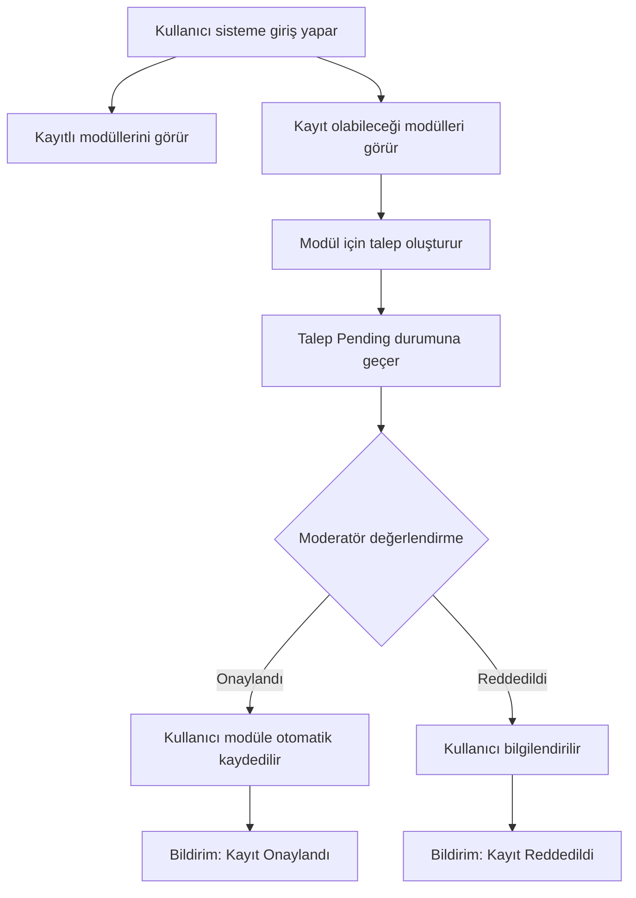
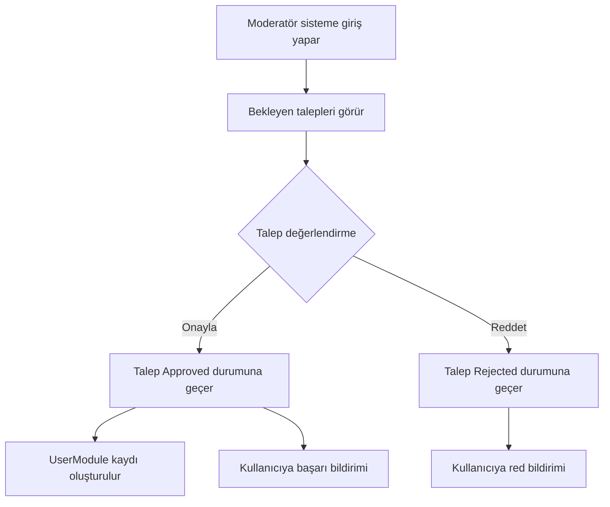

# 🎓 Modül Kayıt ve Onay Sistemi Dokümantasyonu

## 📋 Genel Bakış

Bu sistem, kullanıcıların sadece **kendilerine atanan modülleri** görmesini ve yeni modüllere **talep-onay** sistemi ile kaydolmasını sağlar.

### Temel Özellikler

✅ **Kullanıcılar:**
- Sadece kayıtlı oldukları modülleri görürler
- Yeni modül için talep oluşturabilirler
- Talep durumlarını takip edebilirler
- Onaylanan taleplerde otomatik olarak modüle kaydedilirler

✅ **Moderatör/Admin:**
- Bekleyen tüm talepleri görürler
- Talepleri onaylayabilir veya reddedebilirler
- Onay/red nedeni yazabilirler
- Kullanıcıya otomatik bildirim gönderilir

## 🎭 Roller

### 1. **Student (Öğrenci)**
- Kayıtlı olduğu modülleri görüntüleme
- Yeni modül için talep oluşturma
- Kendi taleplerini görüntüleme

### 2. **Moderator (Onaylayıcı)**
- Tüm bekleyen talepleri görüntüleme
- Talepleri onaylama/reddetme
- Student rolünün tüm yetkilerine sahip

### 3. **Admin (Yönetici)**
- Moderator'ün tüm yetkilerine sahip
- Modül/Eğitim/Alt Başlık yönetimi
- Kullanıcı yönetimi

## 🔄 İş Akışı (Workflow)

### Kullanıcı Perspektifi



### Moderatör Perspektifi



## 📡 API Endpoints

### Kullanıcı Endpoints

#### 1. Kayıtlı Modülleri Getir

```http
GET /api/modules
Authorization: Bearer {token}
```

**Response:**
```json
{
  "isSuccess": true,
  "data": [
    {
      "id": "module-guid",
      "name": ".NET Core Eğitimi",
      "description": "Modern .NET ile backend development",
      "orderIndex": 0,
      "isActive": true,
      "imagePath": "/content/modules/dotnet.png",
      "estimatedDurationMinutes": 1200,
      "totalTrainings": 5,
      "completionPercentage": 45,
      "isCompleted": false
    }
  ]
}
```

**Not:** Bu endpoint SADECE kullanıcının kayıtlı olduğu modülleri döner.

#### 2. Kayıt Olunabilecek Modülleri Getir

```http
GET /api/modules/available
Authorization: Bearer {token}
```

**Response:**
```json
{
  "isSuccess": true,
  "data": [
    {
      "id": "module-guid",
      "name": "Python ile Veri Bilimi",
      "description": "Python ve Data Science",
      "imagePath": "/content/modules/python.png",
      "estimatedDurationMinutes": 2000,
      "hasPendingRequest": false,
      "lastRequestStatus": null,
      "lastRequestDate": null
    },
    {
      "id": "module-guid-2",
      "name": "React Advanced",
      "description": "İleri seviye React",
      "imagePath": "/content/modules/react.png",
      "estimatedDurationMinutes": 1500,
      "hasPendingRequest": true,
      "lastRequestStatus": "Pending",
      "lastRequestDate": "2024-01-15T10:00:00Z"
    }
  ]
}
```

#### 3. Modül Kaydı Talebi Oluştur

```http
POST /api/modulerequests
Authorization: Bearer {token}
Content-Type: application/json

{
  "moduleId": "module-guid",
  "requestReason": "Bu modülü tamamlayarak kariyer hedeflerime ulaşmak istiyorum. Python bilgimi geliştirmek ve veri analizi alanında uzmanlaşmak için bu eğitime ihtiyacım var."
}
```

**Validasyonlar:**
- `moduleId`: Gerekli
- `requestReason`: Gerekli, min 10 karakter, max 500 karakter

**Response:**
```json
{
  "isSuccess": true,
  "message": "Kayıt talebiniz başarıyla oluşturuldu. Moderatör onayı bekleniyor.",
  "data": "request-guid"
}
```

**Hatalar:**
```json
{
  "isSuccess": false,
  "message": "Bu modüle zaten kayıtlısınız.",
  "errors": ["Duplicate enrollment"]
}
```

```json
{
  "isSuccess": false,
  "message": "Bu modül için zaten bekleyen bir talebiniz var.",
  "errors": ["Pending request exists"]
}
```

#### 4. Kendi Taleplerimi Getir

```http
GET /api/modulerequests/my-requests
Authorization: Bearer {token}
```

**Response:**
```json
{
  "isSuccess": true,
  "data": [
    {
      "id": "request-guid",
      "userId": "user-guid",
      "userName": "Ahmet Yılmaz",
      "userEmail": "ahmet@example.com",
      "moduleId": "module-guid",
      "moduleName": "Python ile Veri Bilimi",
      "requestReason": "Kariyer hedeflerim için gerekli...",
      "status": "Pending",
      "reviewedBy": null,
      "reviewerName": null,
      "reviewedDate": null,
      "reviewNote": null,
      "createdDate": "2024-01-15T10:00:00Z"
    },
    {
      "id": "request-guid-2",
      "userId": "user-guid",
      "userName": "Ahmet Yılmaz",
      "userEmail": "ahmet@example.com",
      "moduleId": "module-guid-2",
      "moduleName": ".NET Core Advanced",
      "requestReason": "İleri seviye .NET bilgisi...",
      "status": "Approved",
      "reviewedBy": "moderator-guid",
      "reviewerName": "Moderatör Ali",
      "reviewedDate": "2024-01-15T11:00:00Z",
      "reviewNote": "Başvurunuz uygun bulundu.",
      "createdDate": "2024-01-14T09:00:00Z"
    }
  ]
}
```

**Status Değerleri:**
- `Pending` - Beklemede
- `Approved` - Onaylandı
- `Rejected` - Reddedildi

---

### Moderatör/Admin Endpoints

#### 1. Bekleyen Talepleri Getir

```http
GET /api/moderator/moderatormodulerequests/pending
Authorization: Bearer {moderator_token}
Roles: Moderator, Admin
```

**Response:**
```json
{
  "isSuccess": true,
  "data": [
    {
      "id": "request-guid",
      "userId": "user-guid",
      "userName": "Ahmet Yılmaz",
      "userEmail": "ahmet@example.com",
      "moduleId": "module-guid",
      "moduleName": "Python ile Veri Bilimi",
      "requestReason": "Kariyer hedeflerim için bu modülü tamamlamak istiyorum...",
      "status": "Pending",
      "reviewedBy": null,
      "reviewerName": null,
      "reviewedDate": null,
      "reviewNote": null,
      "createdDate": "2024-01-15T10:00:00Z"
    }
  ]
}
```

#### 2. Talebi Onayla

```http
POST /api/moderator/moderatormodulerequests/{requestId}/approve
Authorization: Bearer {moderator_token}
Roles: Moderator, Admin
Content-Type: application/json

{
  "reviewNote": "Başvurunuz uygun bulunmuştur. Modüle kaydınız yapılmıştır."
}
```

**Response:**
```json
{
  "isSuccess": true,
  "message": "Talep onaylandı ve kullanıcı modüle kaydedildi."
}
```

**İşlemler:**
1. ModuleRequest status'u "Approved" olur
2. UserModule kaydı oluşturulur (EnrollmentDate = now)
3. Kullanıcıya "Success" bildirimi gönderilir

#### 3. Talebi Reddet

```http
POST /api/moderator/moderatormodulerequests/{requestId}/reject
Authorization: Bearer {moderator_token}
Roles: Moderator, Admin
Content-Type: application/json

{
  "rejectReason": "Ön koşul modüllerini tamamlamanız gerekmektedir. Önce '.NET Fundamentals' modülünü bitirmenizi öneririz."
}
```

**Validasyonlar:**
- `rejectReason`: Gerekli, min 10 karakter, max 500 karakter

**Response:**
```json
{
  "isSuccess": true,
  "message": "Talep reddedildi ve kullanıcıya bildirim gönderildi."
}
```

**İşlemler:**
1. ModuleRequest status'u "Rejected" olur
2. Kullanıcıya "Warning" bildirimi gönderilir (ret nedeni ile birlikte)

---

## 🗄️ Veritabanı

### ModuleRequests Tablosu

```sql
CREATE TABLE ModuleRequests (
    Id UNIQUEIDENTIFIER PRIMARY KEY,
    UserId UNIQUEIDENTIFIER NOT NULL,
    ModuleId UNIQUEIDENTIFIER NOT NULL,
    RequestReason NVARCHAR(500) NOT NULL,
    Status NVARCHAR(20) NOT NULL DEFAULT 'Pending',
    ReviewedBy UNIQUEIDENTIFIER NULL,
    ReviewedDate DATETIME2 NULL,
    ReviewNote NVARCHAR(500) NULL,
    CreatedBy NVARCHAR(450) NULL,
    CreatedDate DATETIME2 NOT NULL,
    UpdatedBy NVARCHAR(450) NULL,
    UpdatedDate DATETIME2 NULL,
    IsDeleted BIT NOT NULL DEFAULT 0,

    CONSTRAINT FK_ModuleRequests_User FOREIGN KEY (UserId) REFERENCES Users(Id),
    CONSTRAINT FK_ModuleRequests_Module FOREIGN KEY (ModuleId) REFERENCES Modules(Id),
    CONSTRAINT FK_ModuleRequests_Reviewer FOREIGN KEY (ReviewedBy) REFERENCES Users(Id)
);

CREATE INDEX IX_ModuleRequests_UserId ON ModuleRequests(UserId);
CREATE INDEX IX_ModuleRequests_ModuleId ON ModuleRequests(ModuleId);
CREATE INDEX IX_ModuleRequests_Status ON ModuleRequests(Status);
CREATE INDEX IX_ModuleRequests_UserId_ModuleId_Status ON ModuleRequests(UserId, ModuleId, Status);
```

---

## 🔔 Bildirimler

### 1. Talep Onaylandı

**Trigger:** Moderatör talebi onayladığında
**Alıcı:** Talep sahibi kullanıcı
**Tip:** Success
**Başlık:** "Modül Kaydı Onaylandı!"
**Mesaj:** "{ModuleName} modülüne kayıt talebiniz onaylandı. Artık eğitimlere erişebilirsiniz."
**Action URL:** `/modules/{moduleId}`

### 2. Talep Reddedildi

**Trigger:** Moderatör talebi reddeddiğinde
**Alıcı:** Talep sahibi kullanıcı
**Tip:** Warning
**Başlık:** "Modül Kaydı Reddedildi"
**Mesaj:** "{ModuleName} modülüne kayıt talebiniz reddedildi. Neden: {RejectReason}"
**Action URL:** null

---

## 🧪 Test Senaryoları

### Senaryo 1: Başarılı Kayıt Akışı

```bash
# 1. Kullanıcı mevcut kayıtlı modüllerini görür
GET /api/modules
→ Response: Kayıtlı 2 modül

# 2. Kullanıcı kayıt olabileceği modülleri görür
GET /api/modules/available
→ Response: 5 modül (kayıtlı olmayanlar)

# 3. Kullanıcı bir modüle talep oluşturur
POST /api/modulerequests
{
  "moduleId": "python-module-id",
  "requestReason": "Python öğrenmek istiyorum..."
}
→ Response: Success, RequestId döner

# 4. Moderatör bekleyen talepleri görür
GET /api/moderator/moderatormodulerequests/pending
→ Response: 1 bekleyen talep

# 5. Moderatör talebi onaylar
POST /api/moderator/moderatormodulerequests/{requestId}/approve
{ "reviewNote": "Onaylandı" }
→ Response: Success

# 6. Kullanıcı bildirim alır
GET /api/notifications
→ "Python modülüne kayıt talebiniz onaylandı"

# 7. Kullanıcı artık modülü görebilir
GET /api/modules
→ Response: Kayıtlı 3 modül (yeni eklenen dahil)
```

### Senaryo 2: Reddedilen Talep

```bash
# 1. Kullanıcı talep oluşturur
POST /api/modulerequests
→ Success

# 2. Moderatör talebi reddeder
POST /api/moderator/moderatormodulerequests/{requestId}/reject
{ "rejectReason": "Ön koşul modüllerini tamamlamalısınız" }
→ Success

# 3. Kullanıcı bildirim alır
GET /api/notifications
→ "Kaydınız reddedildi. Neden: Ön koşul modüllerini tamamlamalısınız"

# 4. Kullanıcı kendi taleplerini kontrol eder
GET /api/modulerequests/my-requests
→ Status: "Rejected"
```

### Senaryo 3: Duplicate Request Kontrolü

```bash
# 1. Kullanıcı bir modüle talep oluşturur
POST /api/modulerequests
{ "moduleId": "module-1" }
→ Success

# 2. Aynı modüle tekrar talep oluşturmaya çalışır
POST /api/modulerequests
{ "moduleId": "module-1" }
→ Error: "Bu modül için zaten bekleyen bir talebiniz var"
```

### Senaryo 4: Erişim Kontrolü

```bash
# 1. Kullanıcı kayıtlı olmadığı bir modülü görüntülemeye çalışır
GET /api/modules/{unregistered-module-id}
→ Error: "Bu modüle erişim yetkiniz yok. Lütfen kayıt talebinde bulunun."

# 2. Kullanıcı talep oluşturur ve onay bekler
POST /api/modulerequests

# 3. Moderatör onaylar
POST .../approve

# 4. Kullanıcı artık modülü görüntüleyebilir
GET /api/modules/{module-id}
→ Success: Modül detayları
```

---

## 📊 İstatistikler ve Raporlama

### Önerilen Metrikler

1. **Talep Metrikleri:**
   - Toplam talep sayısı
   - Pending talep sayısı
   - Onay oranı (Approved / Total)
   - Red oranı (Rejected / Total)
   - Ortalama onay süresi

2. **Modül Metrikleri:**
   - En çok talep edilen modüller
   - En düşük onay oranına sahip modüller

3. **Kullanıcı Metrikleri:**
   - Kayıtlı olduğu modül sayısı
   - Bekleyen talep sayısı
   - Reddedilen talep sayısı

---

## 🔒 Güvenlik

### Yetkilendirme Kontrolleri

1. **Student:**
   - Sadece kendi taleplerini görebilir
   - Sadece kayıtlı olduğu modülleri görebilir
   - Başkasının modüllerine erişemez

2. **Moderator:**
   - Tüm bekleyen talepleri görebilir
   - Talepleri onaylayabilir/reddedebilir
   - Kendi talebi de oluşturabilir (Student yetkisi)

3. **Admin:**
   - Moderator'ün tüm yetkilerine sahip
   - Ek olarak modül/eğitim/kullanıcı yönetimi

### Veri Doğrulama

- Talep nedeni: Min 10, Max 500 karakter
- Red nedeni: Min 10, Max 500 karakter
- Duplicate request kontrolü
- Module existence kontrolü
- User enrollment kontrolü

---

## 🚀 Sonraki Adımlar (İyileştirmeler)

### 1. Otomatik Onay Sistemi
- Belirli kriterleri karşılayan talepler otomatik onaylansın
- Örnek: Belirli modülleri tamamlayan kullanıcılar

### 2. Toplu İşlemler
- Moderatör birden fazla talebi aynı anda onaylayabilsin
- Filtreleme ve sıralama özellikleri

### 3. Talep Süre Limiti
- Bekleyen talepler X gün sonra otomatik iptal edilsin

### 4. İstatistik Dashboard
- Moderatör için talep istatistikleri
- Grafikler ve raporlar

### 5. Email Bildirimleri
- Talep durumu değiştiğinde email gönderimi

---

## 📝 Sonuç

Bu sistem ile:
✅ Kullanıcılar sadece yetkili oldukları içerikleri görürler
✅ Yeni içeriklere erişim kontrollü bir şekilde sağlanır
✅ Moderatörler talepleri kolayca yönetir
✅ Bildirim sistemi ile kullanıcılar anlık bilgilendirilir
✅ Güvenli ve ölçeklenebilir bir yapı oluşturulmuştur

**Sistem hazır ve çalışır durumda!** 🎉
